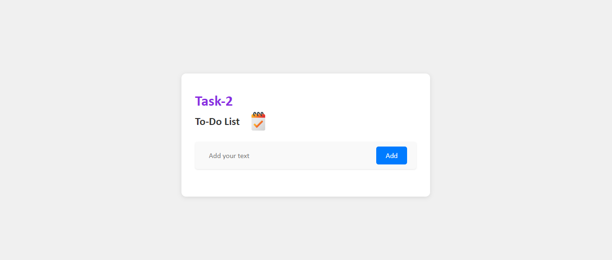
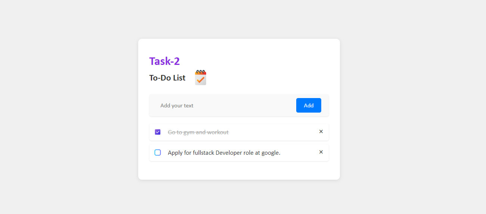

# To-Do List Application

## Overview
This project is a simple to-do list application created using HTML, CSS, and JavaScript. It allows users to add tasks, mark them as complete, and delete tasks from the list.

## Features
- **Add Task:** Users can add tasks to the list by typing the task in the input field and pressing enter or clicking the "Add" button.
- **Mark as Complete:** Completed tasks can be marked by clicking on the checkbox next to each task. A completed task will be visually distinguished from pending tasks.
- **Delete Task:** Users can remove tasks from the list by clicking the delete button associated with each task.

## File Structure
- **index.html:** This file contains the HTML structure of the application including the task input field, task list, and buttons.
- **styles.css:** The CSS file contains styles for the appearance and layout of the application.
- **script.js:** This JavaScript file contains the logic for adding, completing, and deleting tasks dynamically.

## Usage
1. Clone the repository to your local machine.
2. Open the `index.html` file in a web browser.
3. Start adding tasks using the input field.
4. Mark tasks as complete by clicking on the checkbox.
5. Delete tasks by clicking on the delete button.

## Demo
[Link to Live Demo](https://octanet-june-task2.vercel.app/) 

## Screenshots

## Contributing
Contributions are welcome! If you find any issues or have suggestions for improvement, feel free to create a pull request or open an issue.

## License
This project is licensed under the MIT License - see the [LICENSE.md](LICENSE.md) file for details.
